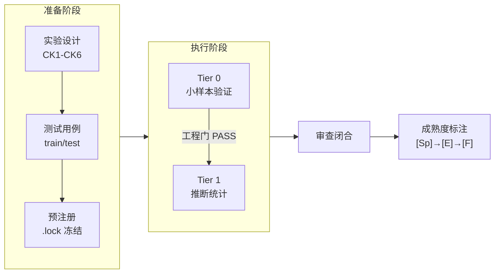

# Prompt-TDD · Prompt 对照实验方法论案例手册

> **English**: A methodology casebook for controlled prompt engineering experiments. Two real experiments with complete data, both yielding negative results honestly reported. Includes experiment design SOP, analysis toolkit, and lessons from 17+ rounds of multi-model review. **CC BY 4.0**.

[]()
[](./en/README.md)
[](./zh-Hant/README.md)

**语言**：简体中文（原文） · [English](en/README.md) · [正體中文](zh-Hant/README.md)  
**定位**：方法论案例手册 (methodology casebook) — **v0.1-methodology**  
**来源**：提炼自 prompt-tdd 项目（2026-06-17 ~ 2026-06-22）

> **这**不是 pip install 的工具库。这是一本**如何做 prompt 对照实验**的操作手册，附带两个真实案例的完整数据、代码和失败分析。

---

> 🧪 2个真实对照实验（均阴性诚实公开）| 17+轮多后端审查 | SOP + 分析工具包 + 完整数据 | git clone 即用

## 核心理念

Amanda Askell（Anthropic）："一个好的 system prompt 背后，那个无聊但关键的秘密是测试驱动开发。"

```
不是:  写 prompt → 发现失败 → 加规则 → 规则打架 → 再加...
而是:  写测试 → 找能通过的 prompt → 发现新失败 → 加入测试集 → 重复
```

---

## 这本手册解决什么问题

| 问题 | 本手册的答案 |
|------|------------|
| 怎么知道改 prompt 真的变好了？ | 对照实验 + 预注册 + 工程门/科学门拆分 |
| 怎么避免"感觉更好了"的错觉？ | 双 LLM 异后端盲评 + 效应量阈值 |
| 怎么防止事后调整假设？ | 预注册锁 (.lock) + train/test 分离 |
| 阴性结果怎么办？ | **公开发布**——A2 和 A3 都是阴性 |
| 天花板效应怎么处理？ | 实验前做 ceiling probe（反编造测试用例） |

---

## 实验管线



### 两个真实案例

| | A2: prep/exec/post 分段 | A3: 声明式 vs NL 路由 |
|------|------|------|
| **角色** | **主案例**——完整管线 | **反例**——如何闭合无信号实验 |
| 任务域 | 代码审查 | Agent 路由决策 |
| 样本量 | n=24/臂 + Qwen 复现 | Pilot: 15 cases |
| 结论 | 阴性 [E-] | 阴性 [E-] |
| 审查 | 6+ 轮 / 3 后端 | 10 轮 / 2 后端 |
| 数据 | [→ A2](examples/a2-prep-exec-post/) | [→ A3](examples/a3-action-routing/) |

---

## 快速开始

```bash
pip install -r requirements.txt
python analyze_experiment.py examples/minimal/scoresheet.csv --tier 0
```

跑通后读 [SOP](sop.md) + [检查清单](methodology/checklists.md)。

---

## 目录结构

```
prompt-tdd-methodology/
├── README.md              ← 你在这里
├── sop.md                 ← 对照实验设计 SOP（CK1-CK6 + Tier 0→1）
├── analyze_experiment.py  ← 分析脚本（CSV→统计→报告）
├── schema/                ← 数据契约
├── examples/
│   ├── minimal/           ←   4-case 玩具（30秒跑通）
│   ├── a2-prep-exec-post/ ←   主案例
│   └── a3-action-routing/ ←   反例案例
├── methodology/
│   ├── lessons-learned.md ←   核心教训（~5KB）
│   ├── glossary.md        ←   术语表
│   └── checklists.md      ←   启动前检查表
└── appendix/
    └── a1-summary.md      ←   A1 为什么没纳入
```

---

## 实证基础

| 指标 | 数据 |
|------|------|
| 完成实验 | A2 + A3 |
| 跨模型复现 | A2: GPT-5.5→Qwen3.7-Max（Δ=−0.014 方向一致） |
| 审查轮次 | 17+（Codex + Qwen + Kimi + ZCode） |
| 方法论产出 | 21 个方法论片段 |

---

## 相关项目

| 项目 | 关系 |
|------|------|
| [**AI协作项目全生命周期框架**](https://github.com/redamancy231-create/ai-collaboration-framework) | **上游集成层**——A2/A3 实验结论已写回 §4.1.1 + §6.3.1-6.3.2；框架 CK1-CK6 检查清单提炼自本手册 |
| [**Independent Review Toolkit**](https://github.com/redamancy231-create/independent-review-toolkit) | **同级工具**——本手册的两个案例实验均使用独立审查 SOP 完成 17+ 轮异后端审查闭合 |
| [**M&A Case Study Pipeline**](https://github.com/redamancy231-create/ma-case-study-pipeline) | **同级项目**——将多模型协作方法论应用于完整学术生产场景的八阶段流水线演示（含 playbook 可复用） |
| [**ETF Pattern Match — pybind11**](https://github.com/redamancy231-create/etf-pattern-match-pybind11) | **同级项目**——pybind11/C++20 加速的量化策略重构；同样强调多后端审查闭合和工程方法的可复现性 |
| [**DOCX Pipeline**](https://github.com/redamancy231-create/docx-pipeline) | **同级项目**——Markdown → 中文 DOCX 泛化管道；经 3 轮 GPT-5.6-Sol 异后端独立审查闭合 |
| [**Claude Skills**](https://github.com/redamancy231-create/claude-skills) | **同级项目**——3 个实战验证的 Claude Code Skill；本手册的对照实验协议在设计上与之互补 |

---

## 许可与引用

CC BY 4.0。v0.1-methodology。

*生成模型：DeepSeek-V4-Pro (via Claude Code CLI) · 2026-07-01*