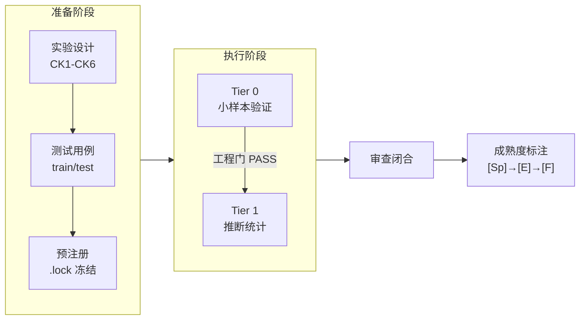

# Prompt-TDD · Prompt Controlled Experiment Methodology Casebook

> **English**: A methodology casebook for controlled prompt engineering experiments. Two real experiments with complete data, both yielding negative results honestly reported. Includes experiment design SOP, analysis toolkit, and lessons from 17+ rounds of multi-model review. **CC BY 4.0**.

**Language**: Simplified Chinese (original)  
**Positioning**: methodology casebook — **v0.1-methodology**  
**Source**: Extracted from the prompt-tdd project (2026-06-17 ~ 2026-06-22)

> **This** is not a `pip install` toolkit. It is an operations manual for **how to run prompt controlled experiments**, with complete data, code, and failure analysis from two real cases.

---

## Core Idea

Amanda Askell (Anthropic): "Behind a good system prompt, the boring but crucial secret is test-driven development."

```
不是:  写 prompt → 发现失败 → 加规则 → 规则打架 → 再加...
而是:  写测试 → 找能通过的 prompt → 发现新失败 → 加入测试集 → 重复
```

---

## What This Manual Solves

| Problem | This Manual's Answer |
|------|------------|
| How do you know a prompt change really made things better? | controlled experiment + pre-registration + separation of the engineering gate and science gate |
| How do you avoid the illusion that it "feels better"? | dual-LLM cross-backend blind scoring + effect size threshold |
| How do you prevent post hoc hypothesis adjustment? | pre-registration lock (.lock) + train/test separation |
| What should you do with a negative result? | **Publish it openly**: A2 and A3 are both negative |
| How should a ceiling effect be handled? | Run a ceiling probe before the experiment (anti-fabrication test cases) |

---

## Experiment Pipeline



### Two Real Cases

| | A2: prep/exec/post segmentation | A3: Declarative vs NL routing |
|------|------|------|
| **Role** | **Main case**: complete pipeline | **Counterexample**: how to close a no-signal experiment |
| Task domain | Code review | Agent routing decision |
| Sample size | n=24/arm + Qwen replication | Pilot: 15 cases |
| Conclusion | negative [E-] | negative [E-] |
| Review | 6+ rounds / 3 backends | 10 rounds / 2 backends |
| Data | [→ A2](examples/a2-prep-exec-post/) | [→ A3](examples/a3-action-routing/) |

---

## Quick Start

```bash
pip install -r requirements.txt
python analyze_experiment.py examples/minimal/scoresheet.csv --tier 0
```

After it runs successfully, read the [SOP](sop.md) + [checklist](methodology/checklists.md).

---

## Directory Structure

```
prompt-tdd-methodology/
├── README.md              ← 你在这里
├── sop.md                 ← 对照实验设计 SOP（CK1-CK6 + Tier 0→1）
├── analyze_experiment.py  ← 分析脚本（CSV→统计→报告）
├── schema/                ← 数据契约
├── examples/
│   ├── minimal/           ←   4-case 玩具（30秒跑通）
│   ├── a2-prep-exec-post/ ←   主案例
│   └── a3-action-routing/ ←   反例案例
├── methodology/
│   ├── lessons-learned.md ←   核心教训（~5KB）
│   ├── glossary.md        ←   术语表
│   └── checklists.md      ←   启动前检查表
└── appendix/
    └── a1-summary.md      ←   A1 为什么没纳入
```

---

## Empirical Basis

| Metric | Data |
|------|------|
| Completed experiments | A2 + A3 |
| cross-model replication | A2: GPT-5.5→Qwen3.7-Max (Δ=−0.014, direction consistent) |
| Review rounds | 17+ (Codex + Qwen + Kimi + ZCode) |
| Methodology outputs | 21 methodology fragments |

---

## Related Projects

| Project | Relationship |
|------|------|
| [**AI Collaboration Project Full Lifecycle Framework**](https://github.com/redamancy231-create/ai-collaboration-framework) | **Upstream integration layer**: A2/A3 experiment conclusions have been written back to §4.1.1 + §6.3.1-6.3.2; the framework's CK1-CK6 checklist was extracted from this manual |
| [**Independent Review Toolkit**](https://github.com/redamancy231-create/independent-review-toolkit) | **Peer toolkit**: both case experiments in this manual used the independent review SOP to complete 17+ rounds of cross-backend review closure |

---

## License and Citation

CC BY 4.0. v0.1-methodology.

*Generated model: DeepSeek-V4-Pro (via Claude Code CLI) · 2026-07-01*
