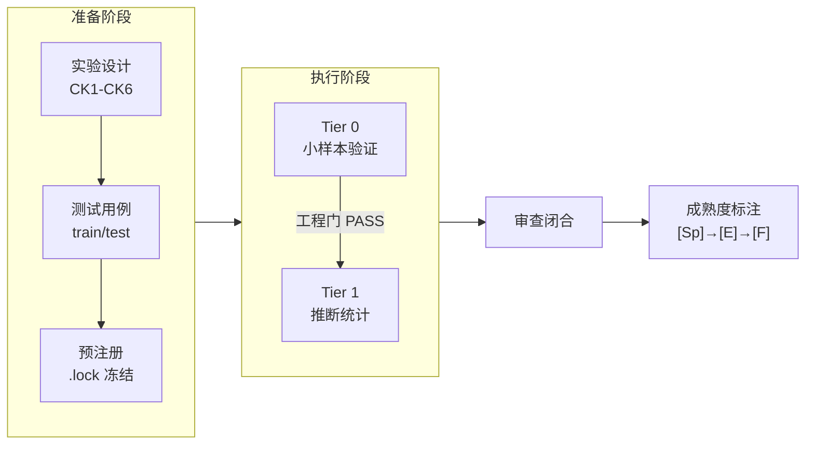

# Prompt-TDD · Prompt Controlled Experiment Methodology Casebook

[](https://creativecommons.org/licenses/by/4.0/)

> **English**: A methodology casebook for controlled prompt engineering experiments. Two real experiments with complete data, both yielding negative results honestly reported. Includes experiment design SOP, analysis toolkit, and lessons from 17+ rounds of multi-model review. **CC BY 4.0**.

**Language**: Simplified Chinese (original)  
**Positioning**: methodology casebook — **v0.1-methodology**  
**Source**: Extracted from the prompt-tdd project (2026-06-17 ~ 2026-06-22)

[](../README.md)
[]()
[](../zh-Hant/README.md)

> **This** is not a `pip install` toolkit. It is an operations manual for **how to run prompt controlled experiments**, with complete data, code, and failure analysis from two real cases.

---

> 🧪 2 real controlled experiments (both negative, honestly reported) | 17+ rounds of multi-backend review | SOP + analysis toolkit + complete data | git clone ready

## Core Idea

Amanda Askell (Anthropic): "Behind a good system prompt, the boring but crucial secret is test-driven development."

```
Not:  write prompt → find failure → add rule → rules conflict → add more...
But:  write tests → find prompt that passes → discover new failure → add to test set → repeat
```

---

## What This Manual Solves

| Problem | This Manual's Answer |
|------|------------|
| How do you know a prompt change really made things better? | controlled experiment + pre-registration + separation of the engineering gate and science gate |
| How do you avoid the illusion that it "feels better"? | dual-LLM cross-backend blind scoring + effect size threshold |
| How do you prevent post hoc hypothesis adjustment? | pre-registration lock (.lock) + train/test separation |
| What should you do with a negative result? | **Publish it openly**: A2 and A3 are both negative |
| How should a ceiling effect be handled? | Run a ceiling probe before the experiment (anti-fabrication test cases) |

---

## Experiment Pipeline



### Two Real Cases

| | A2: prep/exec/post segmentation | A3: Declarative vs NL routing |
|------|------|------|
| **Role** | **Main case**: complete pipeline | **Counterexample**: how to close a no-signal experiment |
| Task domain | Code review | Agent routing decision |
| Sample size | n=24/arm + Qwen replication | Pilot: 15 cases |
| Conclusion | negative [E-] | negative [E-] |
| Review | 6+ rounds / 3 backends | 10 rounds / 2 backends |
| Data | [→ A2](examples/a2-prep-exec-post/) | [→ A3](examples/a3-action-routing/) |

---

## Quick Start

```bash
pip install -r requirements.txt
python analyze_experiment.py examples/minimal/scoresheet.csv --tier 0
```

After it runs successfully, read the [SOP](sop.md) + [checklist](methodology/checklists.md).

---

## Directory Structure

```
prompt-tdd-methodology/
├── README.md              ← You are here
├── sop.md                 ← Controlled Experiment Design SOP (CK1-CK6 + Tier 0→1)
├── analyze_experiment.py  ← Analysis script (CSV→statistics→report)
├── schema/                ← Data contract
├── examples/
│   ├── minimal/           ←   4-case toy (runs in 30s)
│   ├── a2-prep-exec-post/ ←   Main case
│   └── a3-action-routing/ ←   Counterexample case
├── methodology/
│   ├── lessons-learned.md ←   Core lessons (~5KB)
│   ├── glossary.md        ←   Glossary
│   └── checklists.md      ←   Pre-flight checklist
└── appendix/
    └── a1-summary.md      ←   Why A1 was not included
```

---

## Empirical Basis

| Metric | Data |
|------|------|
| Completed experiments | A2 + A3 |
| cross-model replication | A2: GPT-5.5→Qwen3.7-Max (Δ=−0.014, direction consistent) |
| Review rounds | 17+ (Codex + Qwen + Kimi + ZCode) |
| Methodology outputs | 21 methodology fragments |

---

## Related Projects

| Project | Relationship |
|------|------|
| [**AI Collaboration Framework**](https://github.com/redamancy231-create/ai-collaboration-framework) | **Upstream integration layer** — A2/A3 experiment conclusions written back to §4.1.1 + §6.3.1-6.3.2; the framework's CK1-CK6 checklist is distilled from this manual |
| [**Independent Review Toolkit**](https://github.com/redamancy231-create/independent-review-toolkit) | **Sibling tool** — Both case experiments in this manual used the independent review SOP across 17+ rounds of cross-backend review |
| [**M&A Case Study Pipeline**](https://github.com/redamancy231-create/ma-case-study-pipeline) | **Sibling project** — An eight-stage pipeline demonstrating multi-model collaboration methodology applied to a complete academic production scenario (with reusable playbook) |
| [**ETF Pattern Match — pybind11**](https://github.com/redamancy231-create/etf-pattern-match-pybind11) | **Sibling project** — pybind11/C++20 accelerated quantitative strategy refactoring; similarly emphasizes multi-backend review closure and engineering reproducibility |
| [**DOCX Pipeline**](https://github.com/redamancy231-create/docx-pipeline) | **Sibling project** — Markdown → Chinese DOCX pipeline; closed after 3 rounds of GPT-5.6-Sol cross-backend independent review |
| [**Claude Skills**](https://github.com/redamancy231-create/claude-skills) | **Sibling project** — 3 battle-tested Claude Code Skills; this manual's experiment protocol is complementary by design |

---

## License and Citation

CC BY 4.0. v0.1-methodology.

*English translation: GPT-5.5 (via Codex CLI) · 2026-07-01*
