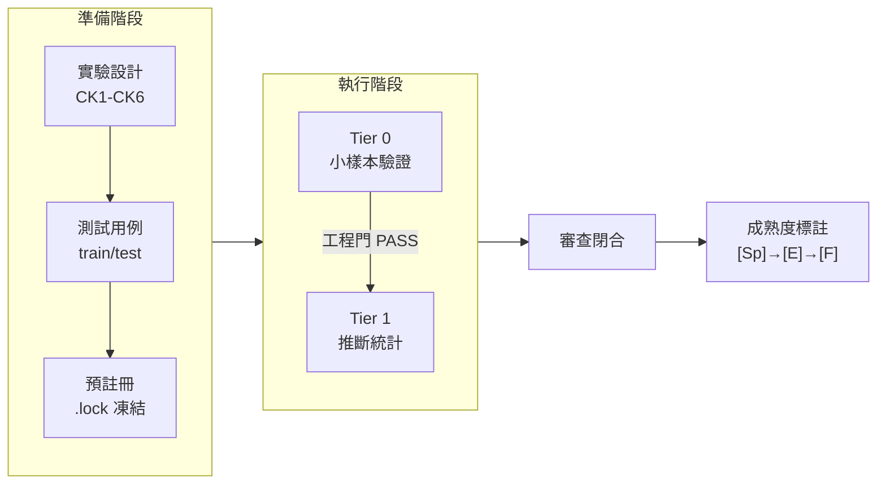

# Prompt-TDD · Prompt 對照實驗方法論案例手冊

[](https://creativecommons.org/licenses/by/4.0/)

> **English**: A methodology casebook for controlled prompt engineering experiments. Two real experiments with complete data, both yielding negative results honestly reported. Includes experiment design SOP, analysis toolkit, and lessons from 17+ rounds of multi-model review. **CC BY 4.0**.

**語言**：簡體中文（原文）  
**定位**：方法論案例手冊 (methodology casebook) — **v0.1-methodology**  
**來源**：提煉自 prompt-tdd 專案（2026-06-17 ~ 2026-06-22）

[](../README.md)
[](../en/README.md)
[]()

> **這**不是 pip install 的工具庫。這是一本**如何做 prompt 對照實驗**的操作手冊，附帶兩個真實案例的完整資料、程式碼和失敗分析。

---

> 🧪 2個真實對照實驗（均陰性誠實公開）| 17+輪多後端審查 | SOP + 分析工具包 + 完整資料 | git clone 即用

## 核心理念

Amanda Askell（Anthropic）："一個好的 system prompt 背後，那個無聊但關鍵的秘密是測試驅動開發。"

```
不是： 寫 prompt → 發現失敗 → 加規則 → 規則打架 → 再加...
而是： 寫測試 → 找能通過的 prompt → 發現新失敗 → 加入測試集 → 重複
```

---

## 這本手冊解決什麼問題

| 問題 | 本手冊的答案 |
|------|------------|
| 怎麼知道改 prompt 真的變好了？ | 對照實驗 + 預註冊 + 工程門/科學門拆分 |
| 怎麼避免"感覺更好了"的錯覺？ | 雙 LLM 異後端盲評 + 效應量閾值 |
| 怎麼防止事後調整假設？ | 預註冊鎖 (.lock) + train/test 分離 |
| 陰性結果怎麼辦？ | **公開發布**——A2 和 A3 都是陰性 |
| 天花板效應怎麼處理？ | 實驗前做 ceiling probe（反編造測試用例） |

---

## 實驗管線



### 兩個真實案例

| | A2: prep/exec/post 分段 | A3: 宣告式 vs NL 路由 |
|------|------|------|
| **角色** | **主案例**——完整管線 | **反例**——如何閉合無訊號實驗 |
| 任務域 | 程式碼審查 | Agent 路由決策 |
| 樣本量 | n=24/臂 + Qwen 復現 | Pilot: 15 cases |
| 結論 | 陰性 [E-] | 陰性 [E-] |
| 審查 | 6+ 輪 / 3 後端 | 10 輪 / 2 後端 |
| 資料 | [→ A2](examples/a2-prep-exec-post/) | [→ A3](examples/a3-action-routing/) |

---

## 快速開始

```bash
pip install -r requirements.txt
python analyze_experiment.py examples/minimal/scoresheet.csv --tier 0
```

跑通後讀 [SOP](sop.md) + [檢查清單](methodology/checklists.md)。

---

## 目錄結構

```
prompt-tdd-methodology/
├── README.md              ← 你在這裡
├── sop.md                 ← 對照實驗設計 SOP（CK1-CK6 + Tier 0→1）
├── analyze_experiment.py  ← 分析腳本（CSV→統計→報告）
├── schema/                ← 資料契約
├── examples/
│   ├── minimal/           ←   4-case 玩具（30秒跑通）
│   ├── a2-prep-exec-post/ ←   主案例
│   └── a3-action-routing/ ←   反例案例
├── methodology/
│   ├── lessons-learned.md ←   核心教訓（~5KB）
│   ├── glossary.md        ←   術語表
│   └── checklists.md      ←   啟動前檢查表
└── appendix/
    └── a1-summary.md      ←   A1 為什麼沒納入
```

---

## 實證基礎

| 指標 | 資料 |
|------|------|
| 完成實驗 | A2 + A3 |
| 跨模型復現 | A2: GPT-5.5→Qwen3.7-Max（Δ=−0.014 方向一致） |
| 審查輪次 | 17+（Codex + Qwen + Kimi + ZCode） |
| 方法論產出 | 21 個方法論片段 |

---

## 相關專案

| 專案 | 關係 |
|------|------|
| [**AI協作專案全生命週期框架**](https://github.com/redamancy231-create/ai-collaboration-framework) | **上游整合層**——A2/A3 實驗結論已寫回 §4.1.1 + §6.3.1-6.3.2；框架 CK1-CK6 檢查清單提煉自本手冊 |
| [**Independent Review Toolkit**](https://github.com/redamancy231-create/independent-review-toolkit) | **同級工具**——本手冊的兩個案例實驗均使用獨立審查 SOP 完成 17+ 輪異後端審查閉合 |
| [**M&A Case Study Pipeline**](https://github.com/redamancy231-create/ma-case-study-pipeline) | **同級專案**——將多模型協作方法論應用於完整學術生產場景的八階段流水線演示（含 playbook 可複用） |
| [**ETF Pattern Match — pybind11**](https://github.com/redamancy231-create/etf-pattern-match-pybind11) | **同級專案**——pybind11/C++20 加速的量化策略重構；同樣強調多後端審查閉合和工程方法的可重現性 |
| [**DOCX Pipeline**](https://github.com/redamancy231-create/docx-pipeline) | **同級專案**——Markdown → 中文 DOCX 泛化管道；經 3 輪 GPT-5.6-Sol 異後端獨立審查閉合 |
| [**Claude Skills**](https://github.com/redamancy231-create/claude-skills) | **同級專案**——3 個實戰驗證的 Claude Code Skill；本手冊的對照實驗協定在設計上與之互補 |

---

## 許可與引用

CC BY 4.0。v0.1-methodology。

*正體中文：OpenCC 轉換 + GPT-5.5 (via Codex CLI) 潤色 · 2026-07-01*
